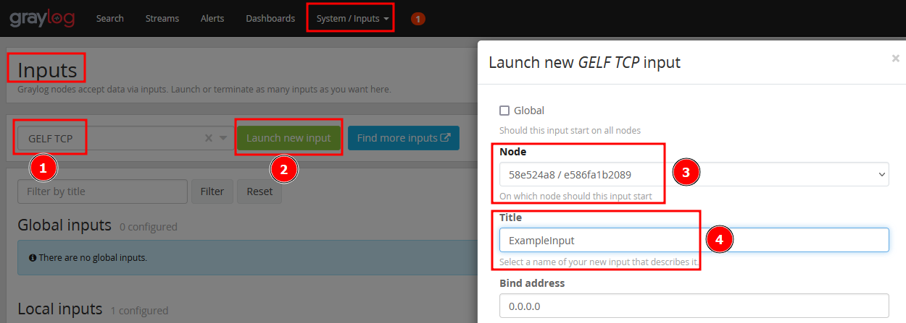

# Graylog Spring Boot Example Project

## Setup Graylog

The easiest way to get `graylog` up and running is using the provided docker compose files. ([Documentation](https://go2docs.graylog.org/5-0/downloading_and_installing_graylog/docker_installation.htm))

The compose file used for this example is provided. (link)
Start the containers:

    docker-compose up -d 


Once graylog is up an running you can login at `https://127.0.0.1:9000` with the default credentials. (admin:admin)

Create a new input: 

## Setup Spring Boot App

The application can be setup using spring initializr. ([Link](https://start.spring.io/))

Make sure to manually add the necessary dependencies. In case you are using maven these are:
```xml
<dependency>
	<groupId>org.graylog2.log4j2</groupId>
	<artifactId>log4j2-gelf</artifactId>
	<version>1.3.1</version>
</dependency>
<dependency>
	<groupId>org.springframework.boot</groupId>
	<artifactId>spring-boot-starter-log4j2</artifactId>
	<version>2.0.4.RELEASE</version>
</dependency>
```

Add a `log4j2.xml` configuration to your project:
```xml
<Configuration monitorInterval="300" status="WARN">
  <properties>
    <property name="FILE_NAME">log</property>
  </properties>
  <Appenders>
    <Console name="Console" target="SYSTEM_OUT">
      <PatternLayout pattern="%d{HH:mm:ss.SSS} [%t] %-5level %logger{36} -- %msg%n"/>
    </Console>
    <GELF name="gelfAppender" server="127.0.0.1" port="12201" hostName="hostname" protocol="TCP">
      <KeyValuePair key="environment" value="DEV"/>
      <KeyValuePair key="additionalFields" value="{'environment': 'development', 'application': 'application'}"/>
    </GELF>
  </Appenders>

  <Loggers>
    <Logger additivity="false" level="error">
      <AppenderRef ref="gelfAppender"/>
    </Logger>
    <Root level="info">
      <AppenderRef ref="Console"/>
      <AppenderRef ref="gelfAppender"/>
    </Root>
  </Loggers>
</Configuration>
```

Log something in your application:
```java
import org.apache.logging.log4j.LogManager;
import org.apache.logging.log4j.Logger;
import org.springframework.boot.SpringApplication;
import org.springframework.boot.autoconfigure.SpringBootApplication;

import jakarta.annotation.PostConstruct;

@SpringBootApplication
public class GraylogTestApplication {

	private final Logger log = LogManager.getLogger(this.getClass());

	public static void main(String[] args) {
		SpringApplication.run(GraylogTestApplication.class, args);
	}

	@PostConstruct
	public void test() throws InterruptedException {
		Thread t = new Thread(new Runnable() {
			@Override
			public void run() {
				while (true) {
					try {
						Thread.sleep(2000);
						log.info("Graylog test");
					} catch (InterruptedException e) {
						e.printStackTrace();
					}
				}
			}
		});
		t.run();
		t.join();
	}
}

```